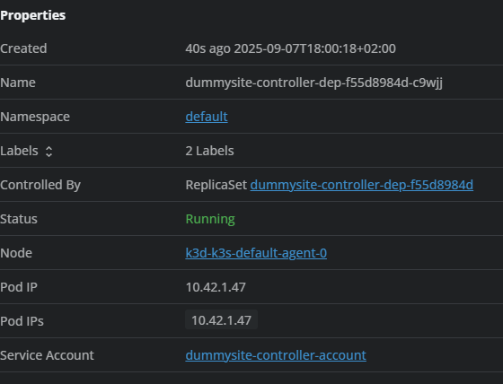
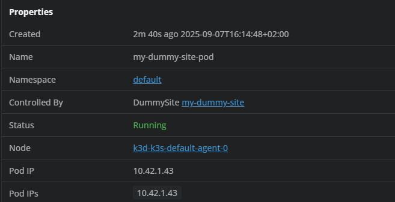
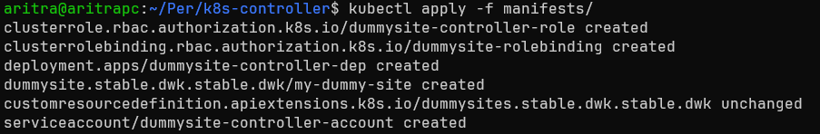
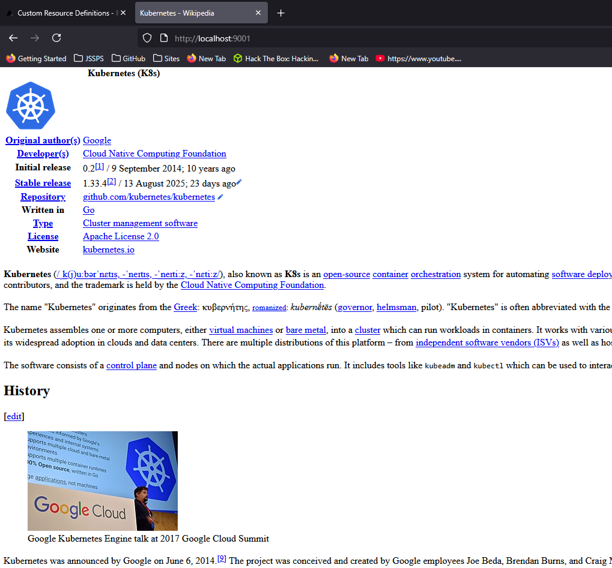

# Custom Kubernetes Controller

Custom Kubernetes Controller written in Go for `DummySite` custom resource.

## Deployment

Run the command

```bash
kubectl apply -f manifests/
```

This will apply the `CustomResourceDefinition`, `ClusterRole`, `ClusterRoleBinding`, `Deployment`, `ServiceAccount` and `DummySite` and will have a Pod running like in the image below (taken from Lens).



## Deployment Notes

Done with sample code and instructions from the DWK material-example [sample app]() and some help from the [kubebuilder.io](https://book.kubebuilder.io/) book.

Read the [Controller README](./controller/README.md) for more instructions on the controller.

The [`controller/api/v1/dummysite_types.go`](./controller/api/v1/dummysite_types.go) file is the file that defines the `DummySite` resource in Go and the [`controller/internal/controller/dummysite_controller.go`](./controller/internal/controller/dummysite_controller.go) defines the actual functionality of the controller.

With the commands

```bash
make generate
make manifests
make install
```

It will generate all the manifest YAMLs and update any configurations for CRDs, which is in the [`config/`](./controller/config/) directory.

### Docker Image Controller

If you make any changes in code, update the Docker image for the controller as well with

```bash
make docker-build docker-push IMG=<username>/dummysite-controller:latest
```

and then deploy it with

```bash
make docker-deploy IMG=<username>/dummysite-controller:latest
```

This will then deploy required deployments and RBACs

### Without Docker Image Controller

For that run

```
make run
```

And check if there are any errors

then apply a `DummySite` resource

```bash
kubectl apply -f manifests/dummysite.yaml`
```

And you will get the pod running with a `DummySite` controller as shown below



## Final Result

Upon applying the manifests



It creates the pod and then a website can be seen like the one below

> It was port-forwarded to port 9001




